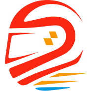
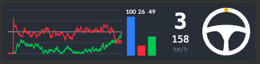
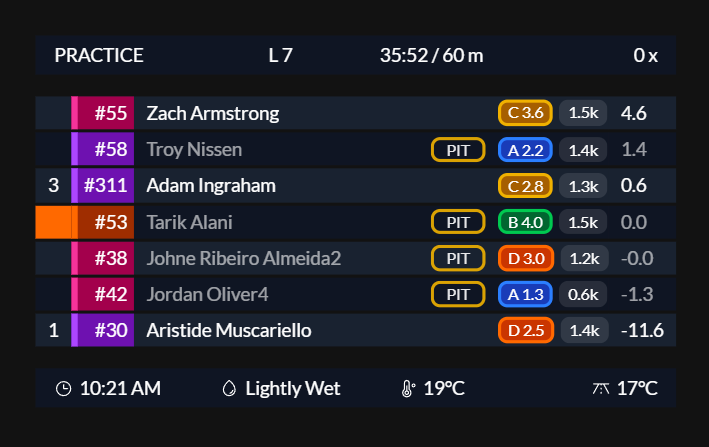
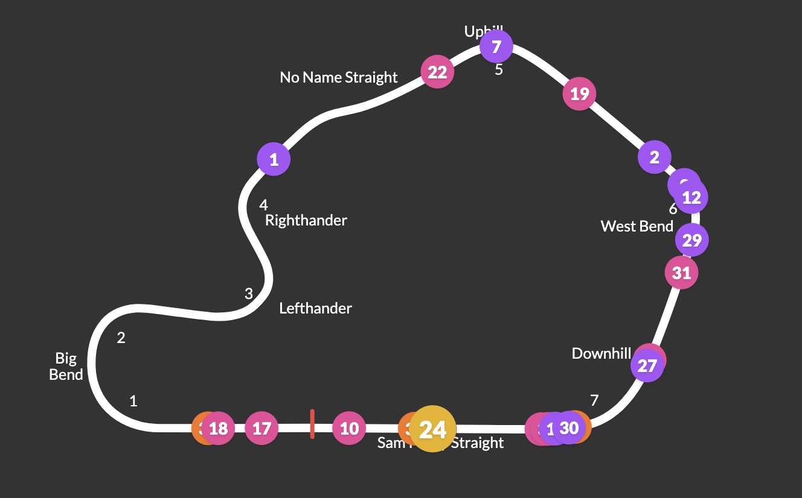
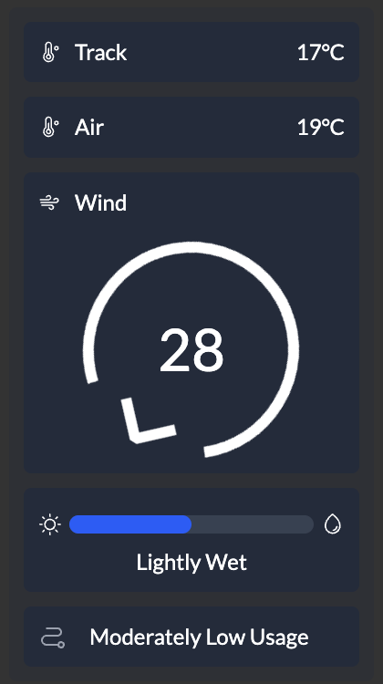
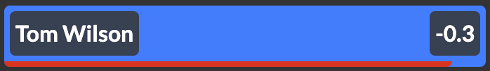
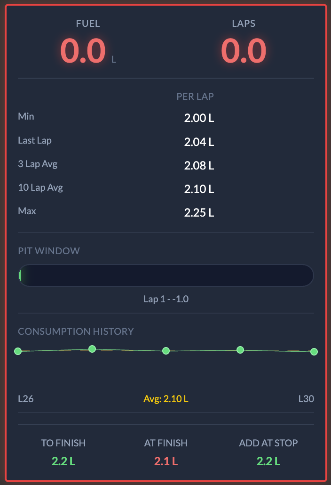
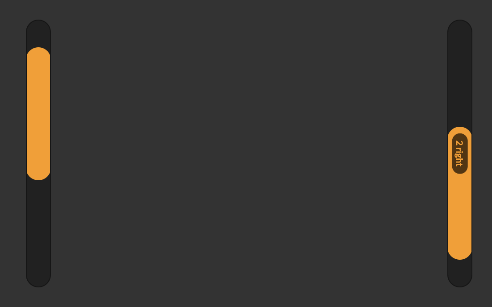

# iRacing Dashies

<div align="center" style="padding-bottom: 20px;">
  
</div>


Welcome to the iRacing Dashies project! This repository contains the code and documentation for building iRacing overlays. 

This is an open-source project that aims to provide a platform to build overlays and utilities for iRacing using React and Electron. 

This is built with the intention of being easily approachable by developers who are familiar with web development as well as not needing to have a deep understanding of the iRacing SDK, C++, or even needing to run iRacing at all.

This project is still in the early stages of development, so there may be bugs and many missing features. If you are interested in contributing please reach out and we can discuss how we can collaborate.

## Try it out

You can try it out by downloading the latest release from the [releases page](https://github.com/tariknz/irdashies/releases).

Install the .exe and run it. The application will automatically update when a new version is available.

## Table of Contents

- [Introduction](#introduction)
- [Prerequisites](#prerequisites)
- [Installation](#installation)
- [Usage](#usage)
- [Folder Structure](#folder-structure)
- [Storybook](#storybook)
- [Package (create .exe)](#package-create-exe)
- [Testing](#testing)
- [Linting](#linting)
- [Contributing](#contributing)
- [License](#license)

## Introduction

This project is built with React and Electron and uses the iRacing SDK to retrieve data from the iRacing live telemetry memory-map.

## Prerequisites

- Node.js (v20 or higher)
- npm (comes with Node.js)
- Windows build tools if you are on Windows
  - Modern Node.js installations include the necessary build tools. If you encounter issues building native modules, ensure you selected the option to install build tools during Node.js installation, or reinstall Node.js with build tools enabled.
- iRacing installed on your machine (Windows only)

> Note: Developing on MacOS is fully supported and does not require iRacing or any additional tools to be installed as it uses a mocked SDK.

## Installation (for development)

To install IRDashies, follow these steps:

1. Clone the repository
2. Navigate to the project directory
3. Install the required dependencies:
  ```bash
  npm install
  ```
4. Run the application:
  ```bash
  npm start
  ```
5. Optionally, you can run the storybook to view the components in isolation:
  ```bash
  npm run storybook
  ```

## Usage (for development)

To start using IRDashies, run the following command:
```bash
npm start
```
This will start the application.

Look for the application in your app tray.

> You will need to have Node.js installed on your machine to run the application. You can download it from [here](https://nodejs.org/).

> On macOS you will see mocked data from a sample session. To connect to iRacing, you will need to run the application on Windows.

While developing its recommended you run storybook as it gives you a quick way to iterate your changes:

```bash
npm run storybook
```

## Folder Structure

The project is structured as follows:

```
irdashies/
  ├── src/
  │   ├── app/
  │   ├── frontend/
  │   ├── types/
```

- `src/app/` contains the main Electron application code.
- `src/app/irsdk/` contains the iRacing SDK code including the native C++ bindings.
- `src/frontend/` contains the React components for the overlays.
- `src/types/` contains TypeScript type definitions shared between the frontend and backend (e.g. telemetry types).

> Note: Frontend components should NOT import anything from ./app as these are Electron-specific modules. Any communication should be done via IPC and types exposed via the types folder.

## Storybook

To view the components in Storybook, run the following command:
```bash
npm run storybook
```

This allows you to easily develop, test, and visualise the widgets/overlays in isolation.

## Package (create .exe)

To package the application and create the .exe, run the following command:
```bash
npm run package
```

To create the .exe and the installer run the following:

```bash
npm run make
```

## Testing

To run the tests, run the following command:
```bash
npm run test
```

## Linting

To run the linting, run the following command:
```bash
npm run lint
```

> Ensure you have ESLint extension installed if using VS Code. This project uses ESLint flat config format (eslint.config.mjs).

## Developing on Mac

As you may know, the iRacing SDK is only available on Windows. To develop on Mac OS, there is a mock SDK that is loaded which generates some dummy data for you to work with. This is useful for developing the UI components and widgets.

## Available overlays

### Input trace

Displays the throttle, clutch, and brake input traces, as well as the current gear and speed.

**Features:**
- Input trace visualization (throttle, brake, ABS indicator, steering)
- Input bar display (clutch, brake, throttle, ABS indicator)
- Current gear display with speed (auto/mph/km/h units)
- Steering wheel visualization with multiple styles (default, formula, LMP, NASCAR, U-shape) and color themes (light/dark)
- Tachometer with optional RPM text display
- Customizable display order for all components



### Standings

Displays standings information for the current session.

**Features:**
- Driver information: position, car number, country flags, driver name, pit status
  - Country flags: Support for 250+ countries, can be enabled/disabled, shows iRacing flag for unaffiliated drivers
  - Pit status indicators: DNF (red), TOW (orange, animated), OUT (green), PIT (yellow, animated), last pit lap number, repair/meatball flag (orange dot), penalty/black flag (orange), slowdown (orange, animated)
- Car details: manufacturer, tire compound
- Driver badges with multiple format options (license/rating combinations)
- Timing information: gap, interval, best lap time, last lap time (multiple time format options)
- iRating change display
- Lap time deltas (configurable number of laps: 1-5)
- Title bar with session progress bar
- Header and footer bars with customizable items:
  - Session name, time remaining, incident count
  - Brake bias, local time, track wetness
  - Air and track temperature (Metric/Imperial units)
- Driver standings configuration:
  - Drivers to show around player
  - Drivers to show in other classes
  - Minimum drivers in player's class
  - Top drivers to always show
- Customizable display order for all columns
- Adjustable background opacity
- Option to show only when on track


### Relative

Displays drive relative delta information for the current session.

**Features:**
- Driver information: position, car number, country flags, driver name, pit status
  - Country flags: Support for 250+ countries, can be enabled/disabled, shows iRacing flag for unaffiliated drivers
  - Pit status indicators: DNF (red), TOW (orange, animated), OUT (green), PIT (yellow, animated), last pit lap number, repair/meatball flag (orange dot), penalty/black flag (orange), slowdown (orange, animated)
- Car details: manufacturer, tire compound
- Driver badges with multiple format options (license/rating combinations)
- Relative delta timing display
- Timing information: best lap time, last lap time (multiple time format options)
- iRating change display (optional)
- Enhanced gap calculation with advanced options:
  - Interpolation methods (linear, cubic spline)
  - Configurable max lap history (3, 5, 7, or 10 laps)
  - Uses position/time records for accurate multi-class gaps
- Title bar with session progress bar
- Header and footer bars with customizable items:
  - Session name, time remaining, incident count
  - Brake bias, local time, track wetness
  - Air and track temperature (Metric/Imperial units)
- Configurable number of drivers to show around player (1-10)
- Customizable display order for all columns
- Adjustable background opacity
- Option to show only when on track



### Track Map

Displays a track map with the current position of the cars on track and the track layout with the turn numbers / names.

**Features:**
- Real-time car positions on track
- Track layout visualization
- Map style options:
  - Shape: Traditional curved track layout (default)
  - Flat: Horizontal linear track representation
- Optional turn numbers and names display
- Multi-class support
- Configurable driver and player circle sizes



### Weather

Displays the weather information for the current session.

**Features:**
- Current weather conditions
- Track and air temperature
- Wind speed and direction
- Humidity and precipitation
- Adjustable background opacity



### Faster Cars From Behind

Displays information about faster cars approaching from behind, including driver name, distance, and a visual indicator that pulses when cars are close.

**Features:**
- Driver name and distance display
- Visual pulsing indicator when cars are close
- Configurable distance threshold for alerts
- Real-time detection of faster approaching cars



### Fuel Calculator

Displays comprehensive fuel management information including current fuel level, fuel consumption per lap (min, max, averages), pit window timing, fuel required to finish, and consumption history graphs. Supports both vertical and horizontal layouts.

**Features:**
- Fuel units: Liters (L) or Gallons (gal)
- Layout options: Vertical or horizontal
- Consumption statistics:
  - Minimum consumption
  - Last lap consumption
  - 3-lap average
  - 10-lap average
  - Maximum consumption
  - Fuel required calculations
- Pit window timing information
- Endurance strategy display (total pit stops and stint info for long races)
- Consumption history graphs:
  - Line chart (5 laps)
  - Histogram (30 laps)
- Configurable safety margin (0-20%) for fuel calculations
- Adjustable background opacity



### Blind Spot Monitor

Displays visual indicators on the left and right sides of the screen when cars are detected in your blind spots. The indicator position dynamically adjusts based on the distance to the detected car.

**Features:**
- Left and right side detection
- Visual amber indicator bars that move vertically based on car distance
- Detection of single car or multiple cars (2 cars) on each side
- Configurable detection distances:
  - Distance ahead (3-6 meters)
  - Distance behind (3-6 meters)
- Adjustable indicator width (5-100px)
- Adjustable background opacity
- Only displays when on track
- Real-time position tracking based on lap distance



## Contributing

We welcome contributions to the IRDashies project! If you have any ideas, suggestions, or bug reports, please open an issue or submit a pull request.

Join our discord here: https://discord.gg/YMAqduF2Ft

## License

This project is licensed under the MIT License. See the [LICENSE](LICENSE) file for more details.