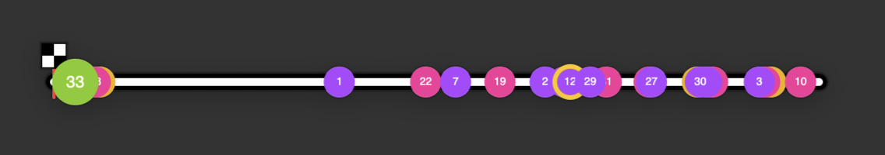
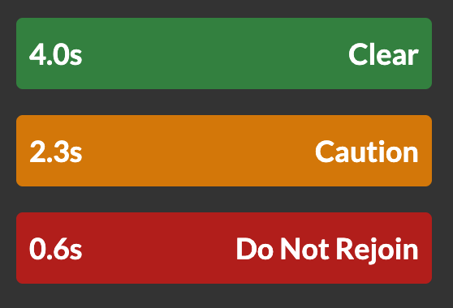
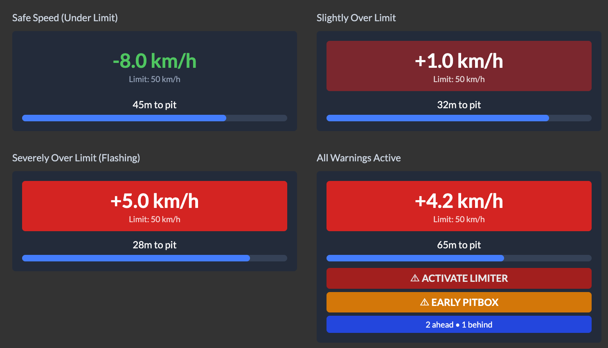

# iRacing Dashies

<div align="center" style="padding-bottom: 20px;">
  
</div>

Welcome to the iRacing Dashies project! This repository contains the code and documentation for building iRacing overlays.

This is an open-source project that aims to provide a platform to build overlays and utilities for iRacing using React and Electron.

This is built with the intention of being easily approachable by developers who are familiar with web development as well as not needing to have a deep understanding of the iRacing SDK, C++, or even needing to run iRacing at all.

This project is still in the early stages of development, so there may be bugs and many missing features. If you are interested in contributing please reach out and we can discuss how we can collaborate.

## Try it out

You can try it out by downloading the latest release from the [releases page](https://github.com/tariknz/irdashies/releases).

Install the .exe and run it. The application will automatically update when a new version is available.

## Table of Contents

- [Introduction](#introduction)
- [Prerequisites](#prerequisites)
- [Installation](#installation)
- [Usage](#usage)
- [Folder Structure](#folder-structure)
- [Storybook](#storybook)
- [Package (create .exe)](#package-create-exe)
- [Testing](#testing)
- [Linting](#linting)
- [Contributing](#contributing)
- [License](#license)

## Introduction

This project is built with React and Electron and uses the iRacing SDK to retrieve data from the iRacing live telemetry memory-map.

## Prerequisites

- Node.js (v20 or higher)
- npm (comes with Node.js)
- Windows build tools if you are on Windows
  - Modern Node.js installations include the necessary build tools. If you encounter issues building native modules, ensure you selected the option to install build tools during Node.js installation, or reinstall Node.js with build tools enabled.
- iRacing installed on your machine (Windows only)

> Note: Developing on MacOS is fully supported and does not require iRacing or any additional tools to be installed as it uses a mocked SDK.

## Installation (for development)

To install IRDashies, follow these steps:

1. Clone the repository
2. Navigate to the project directory
3. Install the required dependencies:

```bash
npm install
```

4. Run the application:

```bash
npm start
```

5. Optionally, you can run the storybook to view the components in isolation:

```bash
npm run storybook
```

## Usage (for development)

To start using IRDashies, run the following command:

```bash
npm start
```

This will start the application.

Look for the application in your app tray.

> You will need to have Node.js installed on your machine to run the application. You can download it from [here](https://nodejs.org/).

> On macOS you will see mocked data from a sample session. To connect to iRacing, you will need to run the application on Windows.

While developing its recommended you run storybook as it gives you a quick way to iterate your changes:

```bash
npm run storybook
```

## Folder Structure

The project is structured as follows:

```
irdashies/
  ├── src/
  │   ├── app/
  │   ├── frontend/
  │   ├── types/
```

- `src/app/` contains the main Electron application code.
- `src/app/irsdk/` contains the iRacing SDK code including the native C++ bindings.
- `src/frontend/` contains the React components for the overlays.
- `src/types/` contains TypeScript type definitions shared between the frontend and backend (e.g. telemetry types).

> Note: Frontend components should NOT import anything from ./app as these are Electron-specific modules. Any communication should be done via IPC and types exposed via the types folder.

## Storybook

To view the components in Storybook, run the following command:

```bash
npm run storybook
```

This allows you to easily develop, test, and visualise the widgets/overlays in isolation.

## Package (create .exe)

To package the application and create the .exe, run the following command:

```bash
npm run package
```

To create the .exe and the installer run the following:

```bash
npm run make
```

## Testing

To run the tests, run the following command:

```bash
npm run test
```

## Linting

To run the linting, run the following command:

```bash
npm run lint
```

> Ensure you have ESLint extension installed if using VS Code. This project uses ESLint flat config format (eslint.config.mjs).

## Developing on Mac

As you may know, the iRacing SDK is only available on Windows. To develop on Mac OS, there is a mock SDK that is loaded which generates some dummy data for you to work with. This is useful for developing the UI components and widgets.

## Available overlays

### Input trace

Displays the throttle, clutch, and brake input traces, as well as the current gear and speed.

**Features:**

- Input trace visualization (throttle, brake, ABS indicator, steering)
  - Configurable stroke width (1-10px)
  - Configurable max samples (50-1000)
  - Toggle individual inputs (throttle, brake, ABS, steering)
- Input bar display (clutch, brake, throttle, ABS indicator)
  - Toggle individual inputs (clutch, brake, throttle, ABS)
- Current gear display with speed (auto/mph/km/h units)
- Steering wheel visualization with multiple styles (default, formula, LMP, NASCAR, U-shape) and color themes (light/dark)
- Tachometer with optional RPM text display
  - Car-specific LED color and RPM thresholds (powered by [lovely-car-data](https://github.com/Lovely-Sim-Racing/lovely-car-data))
  - Custom shift points configuration per car and gear
  - Multiple indicator styles (glow, pulse, border) with customizable colors
- Customizable display order for all components
- Adjustable background opacity
- Option to show only when on track
- Session visibility settings (Race, Lone Qualify, Open Qualify, Practice, Offline Testing)


### Standings

Displays standings information for the current session.

**Features:**

- Driver information: position, car number, country flags, driver name, team name, pit status
  - Country flags: Support for 250+ countries, can be enabled/disabled, shows iRacing flag for unaffiliated drivers
  - Driver name format: Multiple display formats (e.g., "J. Smith", "John S.", "John Smith", etc.)
  - Pit status indicators: DNF (red), TOW (orange, animated), OUT (green), PIT (yellow, animated), last pit lap number, repair/meatball flag (orange dot), penalty/black flag (orange), slowdown (orange, animated)
  - Optional pit time display
  - Pit lap display mode: Show pit lap number or laps since last pit
  - Compact Mode: A streamlined UI option for a cleaner look
  - Incidents & Off-tracks: Driver rows highlight in yellow when they go off-track
  - Spectator Support: Automatically follows the driver you are watching in iRacing
- Car details: manufacturer (with option to hide if single-make series), tire compound
- Driver badges with multiple format options (license/rating combinations)
  - Full iRating: Option to display the full iRating value instead of just the badge
- Timing information: gap, interval, best lap time, last lap time (multiple time format options)
- iRating change display
- Lap time deltas (configurable number of laps: 1-5)
- Title bar with session progress bar
- Header and footer bars with customizable items and display order:
  - Session name, session time (remaining/elapsed), session clock time, incident count
  - Brake bias, local time, track wetness, precipitation
  - Air and track temperature (Metric/Imperial units)
- Driver standings configuration:
  - Drivers to show around player
  - Drivers to show in other classes
  - Minimum drivers in player's class
  - Top drivers to always show
- Customizable display order for all columns
- Adjustable background opacity
- Option to show only when on track
- Option to use live position standings (updates continuously vs only at start/finish line)
- Session visibility settings (Race, Lone Qualify, Open Qualify, Practice, Offline Testing)


### Relative

Displays drive relative delta information for the current session.

**Features:**

- Driver information: position, car number, country flags, driver name, team name, pit status
  - Country flags: Support for 250+ countries, can be enabled/disabled, shows iRacing flag for unaffiliated drivers
  - Driver name format: Multiple display formats (e.g., "J. Smith", "John S.", "John Smith", etc.)
  - Pit status indicators: DNF (red), TOW (orange, animated), OUT (green), PIT (yellow, animated), last pit lap number, repair/meatball flag (orange dot), penalty/black flag (orange), slowdown (orange, animated)
  - Optional pit time display
  - Pit lap display mode: Show pit lap number or laps since last pit
  - Compact Mode: A streamlined UI option for a cleaner look
  - Incidents & Off-tracks: Driver rows highlight in yellow when they go off-track
  - Spectator Support: Automatically follows the driver you are watching in iRacing
- Car details: manufacturer (with option to hide if single-make series), tire compound
- Driver badges with multiple format options (license/rating combinations)
- Relative delta timing display with configurable precision
- Timing information: best lap time, last lap time (multiple time format options: full, mixed, minutes, seconds-full, seconds-mixed, seconds)
- iRating change display (optional)
- Enhanced gap calculation with advanced options:
  - Interpolation methods (linear, cubic spline)
  - Configurable max lap history (3, 5, 7, or 10 laps)
  - Uses position/time records for accurate multi-class gaps
- Title bar with session progress bar
- Header and footer bars with customizable items and display order:
  - Session name, session time (remaining/elapsed), session clock time, incident count
  - Brake bias, local time, track wetness, precipitation
  - Air and track temperature (Metric/Imperial units)
- Configurable number of drivers to show around player (1-10)
- Customizable display order for all columns
- Adjustable background opacity
- Option to show only when on track
- Option to use live position (updates continuously vs only at start/finish line)
- Session visibility settings (Race, Lone Qualify, Open Qualify, Practice, Offline Testing)


### Track Map

Displays a track map with the current position of the cars on track and the track layout with the turn numbers / names.

**Features:**

- Real-time car positions on track
- Track layout visualization
- Optional turn numbers and names display
- Show/hide car numbers on driver circles
- Configurable driver and player circle sizes (10-100px)
- Configurable track line width (1-100px) and outline width (1-150px)
- Option to invert track colors (black track with white outline)
- Option to use highlight color for player circle
- Multi-class support
- Session visibility settings (Race, Lone Qualify, Open Qualify, Practice, Offline Testing)
- Race positions: Driver circles can display their current race position
- Off-track highlighting: Car markers highlight when a driver goes off the track (yellow outline)


### Flat Track Map

Displays a simplified horizontal track map showing driver positions along a flat line representation of the track. Similar to Track Map but uses a linear horizontal layout.

**Features:**

- Real-time car positions on horizontal track line
- Start/finish line with checkered flag
- Show/hide car numbers on driver circles
- Configurable driver and player circle sizes (10-100px)
- Configurable track line width (5-40px) and outline width (10-80px)
- Option to invert track colors (black track with white outline)
- Option to use highlight color for player circle
- Auto-scales to container width
- Multi-class support



### Weather

Displays the weather information for the current session.

**Features:**

- Current weather conditions: track state, track and air temperature, wind speed and direction, humidity, precipitation, track wetness
- Customizable display order for all weather elements
- Temperature units: Auto (based on iRacing settings), Metric (°C), or Imperial (°F)
- Adjustable background opacity
- Option to show only when on track
- Session visibility settings (Race, Lone Qualify, Open Qualify, Practice, Offline Testing)


### Faster Cars From Behind

Displays information about faster cars approaching from behind, including driver name, distance, and a visual indicator that pulses when cars are close.

**Features:**

- Driver name and distance display
- Visual pulsing indicator when cars are close
- Configurable distance threshold for alerts
- Real-time detection of faster approaching cars


### Fuel Calculator

Displays comprehensive fuel management information including current fuel level, fuel consumption per lap (min, max, averages), pit window timing, fuel required to finish, and consumption history graphs. Supports both vertical and horizontal layouts.

**Features:**

- Fuel units: Liters (L) or Gallons (gal)
- Layout options: Vertical or horizontal
- Consumption statistics:
  - Minimum consumption
  - Last lap consumption
  - 3-lap average
  - 10-lap average
  - Maximum consumption
  - Fuel required calculations
- Pit window timing information
- Endurance strategy display (total pit stops and stint info for long races)
- Consumption history graphs:
  - Line chart (5 laps)
  - Histogram (30 laps)
- Configurable safety margin (0-20%) for fuel calculations
- Adjustable background opacity
- Earliest pit lap: Shows the earliest possible lap you can pit and still finish the race
- Fuel-to-add mode: Toggle between showing total fuel needed or just what's needed at the next stop
- Target consumption: Shows what fuel saving is required to reach specific lap targets (±1 from current estimate)


### Blind Spot Monitor

Displays visual indicators on the left and right sides of the screen when cars are detected in your blind spots. The indicator position dynamically adjusts based on the distance to the detected car.

**Features:**

- Left and right side detection
- Visual amber indicator bars that move vertically based on car distance
- Detection of single car or multiple cars (2 cars) on each side
- Configurable detection distances:
  - Distance ahead (3-6 meters)
  - Distance behind (3-6 meters)
- Adjustable indicator width (5-100px)
- Adjustable background opacity
- Only displays when on track
- Real-time position tracking based on lap distance


### Garage Cover

Displays a custom image overlay when you are in the garage. Perfect for streaming to show a branded or custom image while in the garage instead of the default iRacing garage view.

**Features:**

- Custom image upload (drag and drop or file selection)
- Only displays when in garage
- Browser source compatible for OBS and other streaming software
- Accessible via browser at `http://localhost:3000/component/garagecover`
- Image preview in settings

### Rejoin Indicator

Displays a safety indicator showing the gap to the car behind and whether it's safe to rejoin the track after leaving the pits or garage. Provides clear visual feedback with color-coded status (Clear/Caution/Do Not Rejoin).

**Features:**

- Real-time gap calculation to the nearest on-track car behind
- Color-coded status indicators:
  - Green (Clear): Safe to rejoin (gap above care threshold)
  - Amber (Caution): Exercise caution when rejoining (gap between care and stop thresholds)
  - Red (Do Not Rejoin): Not safe to rejoin (gap below stop threshold)
- Configurable speed threshold (default: 30 km/h) - only shows when at or below this speed
- Configurable gap thresholds:
  - Care gap: Distance where caution is needed
  - Stop gap: Distance where rejoining is unsafe
- Automatically hides when:
  - Player is in garage, pit stall, or on pit road
  - No valid on-track car is detected behind
  - During standing start (pre-race session states)
- Only displays when driving and on track



### Pitlane Helper

Helps you manage your pit stops with clear visual guidance. It assists with speed limits, finding your pit box, and monitoring pitlane traffic.

**Features:**

- Speed Limit Assistant: Colour-coded warnings (Green/Amber/Red) show how close you are to the pit speed limit.
- Pitbox Countdown: A distance tracker and progress bar show exactly how far you are from your pit stall.
- Countdown Bars: Colour-coded progress bars for pit entry, pitbox, and pit exit distances (Green → Yellow → Blue).
  - Configurable vertical/horizontal orientation with side-by-side layout option
- Pit Exit Inputs: Throttle/clutch display to optimize pit exits with phase-based visibility options.
- Traffic Monitor: See how many cars are currently ahead or behind you in the pitlane.
- Early Warning: Alerts you if your pitbox is located near the pit entry.
- Pit limiter alerts: Flashing warnings if you enter the pits without your limiter active (auto-disabled for series with automatic limiters).



### Telemetry Inspector

A powerful tool for viewing live data coming from iRacing. While mostly used for debugging, it's great for seeing exactly what data the app is receiving in real-time.

### Other Features

**Features:**

- Streamer & OBS Ready
  - Built-in Web Server: Every overlay can be used as a browser source in OBS. Just use `http://localhost:3000/component/<name>`.
  - Garage Cover: Automatically hide your screen with a custom image when you enter the garage to keep your car setup private.
  - Transparent backgrounds: All overlays are designed to look great on top of your game or stream.
- Customization & Themes
  - Color themes: Choose from built-in themes or create your own custom look.
  - Highlight color: Pick a custom color that is used across all widgets to match your branding or preference.
  - Font sizes: Multiple font size options to ensure readability on any screen.
  - Font weight: Choose between Normal, Bold, or Extra Bold text for improved readability.
- Ease of Use
  - Global toggle (Alt+H): Quickly hide or show all your overlays with a single keyboard shortcut.
  - Always on top: Keep your overlays visible even when clicking on other windows.
  - System autostart: Optionally have the app start automatically when your computer boots up.
  - Automatic updates: The app keeps itself up to date with the latest features and bug fixes.

## Acknowledgments

This project makes use of data and resources from the following projects:

- **[lovely-car-data](https://github.com/Lovely-Sim-Racing/lovely-car-data)** - Comprehensive car telemetry data including RPM thresholds, LED configurations, and shift point information for various racing games.

## Contributing

We welcome contributions to the IRDashies project! If you have any ideas, suggestions, or bug reports, please open an issue or submit a pull request.

Join our discord here: https://discord.gg/YMAqduF2Ft

## License

This project is licensed under the MIT License. See the [LICENSE](LICENSE) file for more details.
