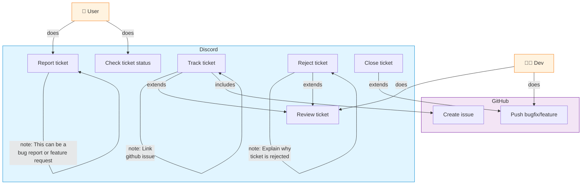

```mermaid
graph TD
    subgraph discord["Discord"]
        report["Report ticket"]
        check["Check ticket status"]
        review["Review ticket"]
        track["Track ticket"]
        reject["Reject ticket"]
        close["Close ticket"]
    end

    subgraph github["GitHub"]
        createIssue["Create issue"]
        push["Push bugfix/feature"]
    end

    user["👤 User"]
    dev["👨‍💻 Dev"]

    user -->|does| report
    user -->|does| check
    
    dev -->|does| review
    dev -->|does| push

    report -->|note: This can be a<br/>bug report or feature request| report
    track -->|note: Link<br/>github issue| track
    reject -->|note: Explain why<br/>ticket is rejected| reject

    reject -->|extends| review
    track -->|extends| review
    track -->|includes| createIssue
    close -->|extends| push

    style discord fill:#e1f5ff,stroke:#0288d1
    style github fill:#f3e5f5,stroke:#7b1fa2
    style user fill:#fff3e0,stroke:#f57f17
    style dev fill:#fff3e0,stroke:#f57f17
```